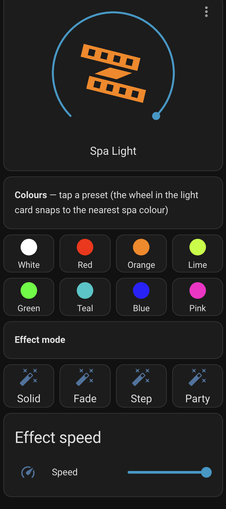

# hass-spanet - supports new SpaNET v2 protocol

Control your SpaNET Spa with Home Assistant

 
 

### Current Progress

 - [x] Sensors
 - [x] HVAC Control
 - [x] Pumps
 - [x] Blower (fan — variable speed & ramp)
 - [x] Operation Mode
 - [x] Power Save
 - [x] Sleep Timers
 - [x] HeatPump Support (Enable via Configure screen)
 - [x] Lights — brightness, colour & effects
 - [x] Sanitise / clean cycle
 - [x] Filtration (runtime, interval & status)
 - [x] Keypad lock
 - [x] Auto-sanitise time
 - [x] Pump timeout

### Tested with Home Assistant 2026.7

# configuration

Simply add the plugin and then provide your SpaNET email and password, all Spas on your account will accessible.

# entities

Each spa exposes the following entities (prefixed with your spa's name):

| Entity | Type | Notes |
| --- | --- | --- |
| Climate | `climate` | Target/current temperature, heating state |
| Pumps | `switch` / `select` | Single-speed pumps are switches; variable-speed pumps are selects |
| Blower | `fan` | On/off, variable speed (1–5) and a `ramp` preset |
| Lights | `light` | On/off, brightness, an RGB colour wheel that snaps to the nearest supported spa colour, and the fade / step / party effect modes |
| Light Speed | `number` | Speed of the fade / step / party effects |
| Sanitise | `switch` + `binary_sensor` | Start/stop the one-touch clean cycle; the read-only sensor is kept for existing automations |
| Filtration | `binary_sensor` + `number` | Running status, plus total runtime and hours-between-cycles |
| Keypad Lock | `select` | Off / Partial / Full |
| Auto Sanitise Time | `time` | Daily automatic sanitise time |
| Pump Timeout | `number` | Auto-off timeout for pumps/operation |
| Operation Mode / Power Save / Sleep Timers | `select` / `switch` | |

# dashboards

### Light control

The spa light is a full RGB `light` entity — brightness, a colour wheel that snaps to the nearest supported spa colour, and the fade / step / party effect modes with an adjustable speed.

# shout out to our contributors!

[@montoyenn-spec](https://github.com/montoyenn-spec) - blower, lights, settings, bug fixes
